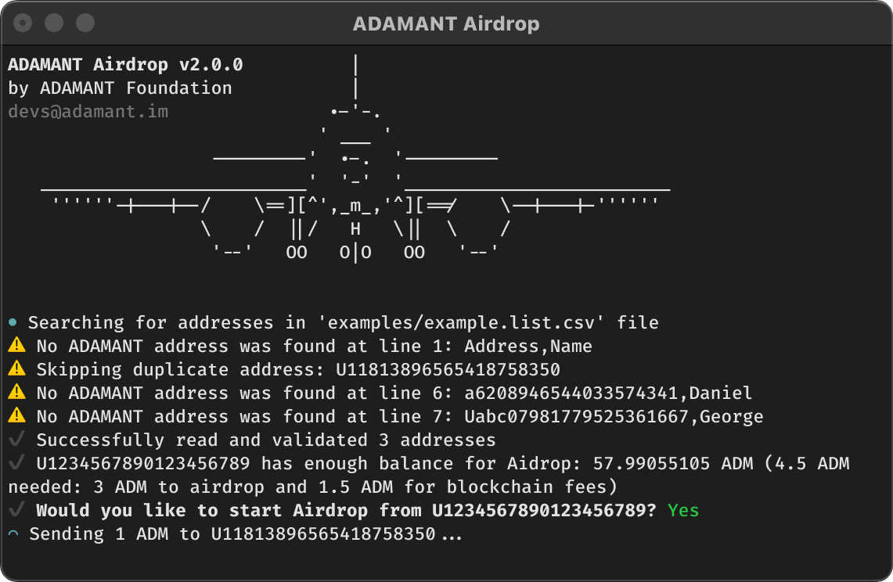

<h1 align="center">ADAMANT Airdrop</h1>

<p align="center">
  The <b>ADAMANT Airdrop</b> is a command-line tool for sending a single, <br>fixed amount of ADM to each recipient in the provided list.
</p>

<p align="center">
  
</p>

## Pre-requirements

To use the ADAMANT Airdrop, you must have:

- **Node.js** (version 18 or higher).

  Make sure you have an up-to-date version of [Node.js](https://nodejs.org) installed. Open your command line and execute:

  ```
  node -v
  ```

  This command will output the Node.js version, ensure it's `v18.0.0` or higher.

- **List of ADAMANT users in a** `.csv`, `.json`, `.jsonc` **or** `.txt` **file.**

  Prepare a clear list format where each line contains one ADAMANT address.

  Example of an acceptable `.csv` list:

  ```
  Address,Name
  U7767749612291339898,Alex
  U5820292448800687929,Jonty
  ```

> [!WARNING]
> Be careful to prevent merging names into addresses or including multiple addresses on the same line, as this can lead to errors during the airdrop process.

## Installation

To use the ADAMANT Airdrop, you only need `npx`, which is preinstalled with the latest versions of Node.js. The `npx` command will automatically download and execute the latest version of the ADAMANT Airdrop:

```
$ npx adamant-airdrop --version

ADAMANT Airdrop v2.1.0
```

If you want to run the project locally, see [development setup](./.github/CONTRIBUTING.md#development-setup) section of [contribution guide](./.github/CONTRIBUTING.md).

## Configuration

Before using, you should create a configuration file. This file enables the Airdrop to access your ADAMANT account and locate the file with the addresses for the airdrop. You can generate default configuration file using the following command:

```
npx adamant-airdrop setup
```

You will be presented with prompt to choose a directory name to contain your configuration file, as well as log files. It's a good practice to set up a new directory for each of your airdrop campaigns to keep logs organized.

Navigate to your directory:

```
cd 'directory_name_you_chose'
```

Now, let's edit configuration file to fit your requirements. You can use any text editor you like, such as VS Code, vim, or nano. In this example, we'll use nano:

```
nano config.jsonc
```

To run the script, you should at least edit the `passphrase` and `inputFile` fields with your account's passphrase and the path to the list of users you wish to airdrop to, respectively.

Example of a configuration:

```jsonc
{
  // Account's passphrase to airdrop from
  "passphrase": "ocean mystery book garden solar mirror cloud river melody shadow anchor breeze",
  // Path to the list of addresses
  "inputFile": "./'Winners List for Airdrop Campaign - Sheet1.csv'",
  // Amount to send for each address
  "amount": 100,

  "nodes": [
    "https://bid.adamant.im",
    "https://lake.adamant.im",
    "https://sunshine.adamant.im"
  ]
}
```

## Usage

After setting up the configuration file, you are ready to use the Airdrop. To start airdrop, simply type the following command in terminal:

```
npx adamant-airdrop ./config.jsonc
```

If you only want to validate addresses, append the `--validate` flag to your command:

```
npx adamant-airdrop --validate ./config.jsonc
```

After a successful airdrop, you can check the `output/` directory for list of successful and failed transactions, and the `logs/` directory for logs.

## Contribution

Please have a look at the [CONTRIBUTING.md](./.github/CONTRIBUTING.md).

<h1></h1>

<p align="center">Licensed under <a href="./LICENSE">GPL-3.0</a>, created by ADAMANT Foundation</p>
